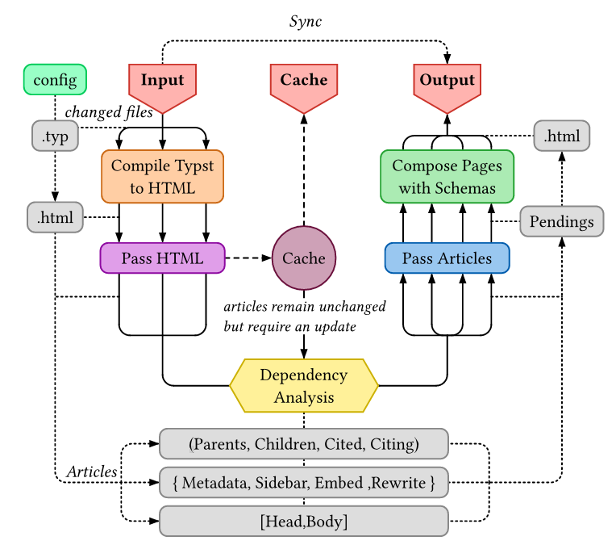

# Typsite
[ **English** | [中文](./README-cn.md) ]

<div style="text-align: center;">

</div>
<div style="text-align: center;">
<a href="https://typ.rowlib.com/en/migrate-to-116" title="Migrating to Typsite 1.1.6 [https://typ.rowlib.com/en/migrate-to-116]">Migrating to Typsite <span style="color: #22d3ee;">1.1.6</span></a>
</div>

## 1. Introduction

Typsite is a static site generator (SSG) that uses pure `Typst` for content creation. It processes these `Typst` files to generate a complete static website.

## 2. Features

-   Core `Typst` expressions and syntax
-   Framework: Incremental headings, section templates, sidebar, footer
-   Rich Text: Paragraphs, sections, quotes, code blocks, math formulas, footnotes, page embeds
-   Typst math -> Mathml (auto detected math-font)
-   Support for modern web technologies: HTML5, CSS3, and JavaScript (ES6+)
-   Automatically typst-packages install & sync (in watch-mode) 
-   Incremental compilation and real-time preview


## 3. About Typst

Typst is a modern typesetting system, similar to LaTeX but designed to be simpler and easier to learn. It's primarily used for creating beautifully typeset documents like academic papers, books, and reports.

You can find the official English documentation here: [Typst Document](https://typst.app/docs/)
For a Chinese tutorial on Typst, I highly recommend the [Typst Blue Book](https://typst-doc-cn.github.io/tutorial/introduction.html) (The author has a remarkably clear understanding of the subject!).

The rest of this section explains the connection between Typst, HTML, and Typsite.

### 3.1 Typst's HTML Export Feature

Typst introduced HTML export functionality in version `0.13`. This includes an `html-export` mode and two core functions: `html.elem` and `html.frame`. These allow us to write content in Typst that targets HTML+CSS output.

### 3.2 Typsite: A Typst-based Static Site Generator

Inspired by this, I developed a static site generator named `Typsite` using `Rust`.

Currently, Typst's HTML export:
-   Has good support for simple rich text.
-   Complex styling requires users to manually write it using the `html.elem` function.
-   Cannot automatically convert all Typst ecosystem content to HTML.
-   For content with complex Typst styling, `html.frame` can be used to convert it to SVG and embed it in HTML.
-   Each compilation only supports single-file HTML output.

For details on supported features and plans, you can track this [issue: HTML export #5512](https://github.com/typst/typst/issues/5512).

While there are official plans for Typst to automatically convert styles to HTML+CSS, this doesn't conflict with Typsite. In fact, Typst's advancement will make Typsite even more useful, as Typsite's primary role is to manage inter-article interactions and build a fully-featured static website.

## 4. Installation

-   Start with template: [Typsite Template](https://github.com/Glomzzz/typsite-template) (HIGHLY RECOMMENDED, for linux / macos)
-   Download the binary from the [Release page](https://github.com/Glomzzz/typsite/releases/latest).
    -   Ensure you have Typst **0.13+** installed.
-   Build using Nix

```shell
git clone https://github.com/OtaNix-ry/typsite.git
cd typsite
nix-build -A package
```

Or just start a shell which will have `typsite` in PATH

```shell
nix-shell -A devShell
```

> Or if you prefer the **unstable** flakes and nix-command features...
> 
> ```shell
> nix build
> ```

## 5. Architecture & Flow



Here's more: [Typsite Documant](https://typ.rowlib.com/en/)

## Contribution

We welcome your contributions to Typsite!

## Acknowledgements

- [kokic](https://github.com/kokic) : [kodama](https://github.com/kokic/kodama) for **Markdown + Typst + LaTeX SSG**
